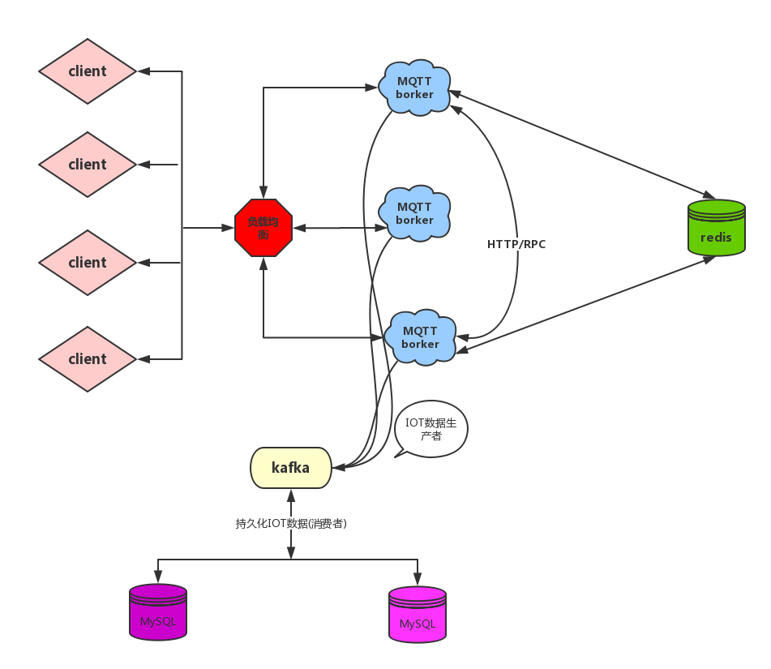

#  iot-mqtt-server

基于netty+SpringBoot+ignite技术栈实现

1. 使用netty实现通信及协议解析
2. 使用SpringBoot提供依赖注入及属性配置
3. 使用ignite实现存储，集群和集群间通信


[TOC]

# 介绍一下项目

基于Netty-SpringBoot-Ignite搭建的消息服务器。实现了MQTT协议标准以及其他自定义通讯协议。主要作用就是对接厂商物联网设备，使用解码器解析并获取报文数据，转换成系统内部传输对象，并进行业务处理。

> 物联网设备数据经PLC采集后，通过数据网关抛到云端的Mqtt Server。Mqtt Server将采集到的数据推送到kafka 消息队列中，负责清洗，处理数据的rule-engine流式任务规则引擎就会消费这些数据。





## MQTT

MQTT（Message Queuing Telemetry Transport，消息队列遥测传输协议）是一个基于**客户端-服务器**的消息发布/订阅传输协议。

MQTT协议具有轻量、简单、开放和易于实现的特点，这使得其在物联网领域被广泛使用。

基于发布/订阅消息模式中，消息不是直接从发送器发送到接收器，而是由Mqtt Server分发的。同时，Mqtt通过提供3种QoS（服务质量）来实现可靠性。

### QoS

QoS 0：消息最多传递一次，如果当时客户端不可用，则会丢失该消息。

QoS 1：消息传递至少 1 次。包含了简单的重发机制，Sender 发送消息之后等待接收者的 ACK，如果没收到 ACK 则重新发送消息。这种模式能保证消息至少能到达一次，但无法保证消息重复。

QoS 2：设计了重发和重复消息发现机制，保证消息到达对方并且严格只到达一次。

### 固定头

在Mqtt数据包的固定头中，有几个比较重要的标识位：

* `DUP`：发布消息的副本。用来保证消息的可靠传输，如果设置为 1，则在下面的变长中增加MessageId，并且需要回复确认，以保证消息传输完成，但不能用于检测消息重复发送。

* `QoS`发布消息的服务质量（前面已经做过介绍），即：保证消息传递的次数

* - `00`：最多一次，即：<=1
  - `01`：至少一次，即：>=1
  - `10`：一次，即：=1
  - `11`：预留

* `RETAIN`：发布保留标识，表示服务器要保留这次推送的信息，如果有新的订阅者出现，就把这消息推送给它，如果设有那么推送至当前订阅者后释放。


### Payload 消息体

`Payload`消息体是`MQTT`数据包的第三部分，CONNECT、SUBSCRIBE、SUBACK、UNSUBSCRIBE四种类型的消息 有消息体：

- `CONNECT`，消息体内容主要是：客户端的ClientID、订阅的Topic、Message以及用户名和密码
- `SUBSCRIBE`，消息体内容是一系列的要订阅的主题以及`QoS`。
- `SUBACK`，消息体内容是服务器对于`SUBSCRIBE`所申请的主题及`QoS`进行确认和回复。
- `UNSUBSCRIBE`，消息体内容是要订阅的主题。

## Netty

### Netty是什么？

Netty是 一个异步事件驱动的网络应用程序框架，用于快速开发可维护的高性能协议服务器和客户端。Netty是基于nio的，它封装了jdk的nio，让我们使用起来更加方便灵活。

### Netty的特点？

* 高并发：   是一款基于 NIO（Nonblocking IO，非阻塞IO）开发的网络通信框架，对比于 BIO（Blocking I/O，阻塞IO），他的并发性能得到了很大提高。
* 传输快：Netty 的传输依赖于零拷贝特性，尽量减少不必要的内存拷贝，实现了更高效率的传输。
* 封装好：Netty 封装了 NIO 操作的很多细节，提供了易于使用的调用接口。

#### 说说Netty的零拷贝

Netty的零拷贝主要包括三个方面：

1. Netty 的接收和发送 ByteBuffer 采用 DIRECT BUFFERS，使用堆外直接内存进行 Socket 读写，不需要进行字节缓冲区的二次拷贝。如果使用传统的堆内存（HEAP BUFFERS）进行 Socket 读写，JVM 会将堆内存 Buffer 拷贝一份到直接内存中，然后才写入 Socket 中。相比于堆外直接内存，消息在发送过程中多了一次缓冲区的内存拷贝。
2. Netty 提供了组合 Buffer 对象，可以聚合多个 ByteBuffer 对象，用户可以像操作一个 Buffer 那样方便的对组合 Buffer 进行操作，避免了传统通过内存拷贝的方式将几个小 Buffer 合并成一个大的 Buffer。
3. Netty 的文件传输采用了 transferTo 方法，它可以直接将文件缓冲区的数据发送到目标 Channel，避免了传统通过循环 write 方式导致的内存拷贝问题。


### Netty的应用场景有哪些？

Netty可构建高性能、低延时的各种Java中间件，例如MQ、分布式服务框架

### BIO、NIO和AIO的区别

* BIO：同步阻塞 I/O 模式，数据的读取写入必须阻塞在一个线程内等待其完成。
* NIO：同步非阻塞I/O模式，提供IO多路复用模型，客户端的连接请求都会注册到多路复用器上，通过这个多路复用器可以用一个线程管理多个IO请求。BIO是面向流的，NIO是面向缓冲区的；BIO的Stream是单向的，而NIO的channel是双向的。
* AIO：异步非阻塞的 I/O模式，异步 IO 是基于事件和回调机制实现的，也就是应用操作之后会直接返回，不会堵塞在那里，当后台处理完成，操作系统会通知相应的线程进行后续的操作。

### Netty Reactor 模式

Reactor模式也叫反应器模式，采用基于事件驱动的设计，当有事件触发时，才会调用处理器进行数据处理。（使用Reactor模式，对线程的数量进行控制，一个线程处理大量的事件。）


在Java中Reactor模式是基于Java NIO的，在他的基础上，抽象出来两个组件——Reactor和Handler：

（1）Reactor：负责响应IO事件，当检测到一个新的事件，将其发送给相应的Handler去处理；新的事件包含连接建立就绪、读就绪、写就绪等。

（2）Handler: 处理器，负责事件的处理，完成channel的读入，处理完业务逻辑后，负责将结果写出channel。

#### Netty 与 Reactor模型中的对应

Netty中的Channel系列类型，对应于经典Reactor模型中的client， 封装了用户的通讯连接。

Netty中的EventLoop系列类型，对应于经典Reactor模型中的Reactor，完成Channel的注册、轮询、分发。

Netty中的Handler系列类型，对应于经典Reactor模型中的Handler，不过Netty中的Handler设计得更加的高级和巧妙，使用了Pipeline模式。

#### 单线程模型

Reactor单线程模型，指的是所有的IO操作都在同一个NIO线程上面完成，即既要处理连接请求，又要处理IO请求，能够这样做的本质是NIO是同步非阻塞IO，所有的IO操作都不会导致阻塞。

对于单线程模型，无法满足高负载，大并发的应用场景。

#### 多线程模型

有专门一个NIO线程-Acceptor线程用于监听服务端，接收客户端的TCP连接请求；网络IO操作-读、写等由一个NIO线程池负责，线程池可以采用标准的JDK线程池实现，它包含一个任务队列和N个可用的线程，由这些NIO线程负责消息的读取、解码、编码和发送。

在绝大多数场景下，Reactor多线程模型都可以满足性能需求；但是，在极个别特殊场景中，一个NIO线程负责监听和处理所有的客户端连接可能会存在性能问题。例如并发百万客户端连接，或者服务端需要对客户端握手进行安全认证，但是认证本身非常损耗性能。在这类场景下，单独一个Acceptor线程可能会存在性能不足问题，为了解决性能问题，产生了第三种Reactor线程模型-主从Reactor多线程模型。

#### 主从多线程模型

服务端用于接收客户端连接的不再是个1个单独的NIO线程，而是一个独立的NIO线程池。

工作流程：

1. 从主线程池中随机选择一个Reactor线程作为Acceptor线程，用于绑定监听端口，接收客户端连接；Acceptor线程接收客户端连接请求之后创建新的SocketChannel，将其注册到主线程池的其它Reactor线程上，由其负责接入认证、IP黑白名单过滤、握手等操作；
2. 步骤1完成之后，业务层的链路正式建立，将SocketChannel从主线程池的Reactor线程的多路复用器上摘除，重新注册到Sub线程池的线程上，用于处理I/O的读写操作。

### TCP粘包/拆包的原因及解决方法？

TCP是以字节流的方式来处理数据，一个完整的包可能会被TCP拆分成多个包进行发送，也可能把多个小的封装成一个大的数据包发送。

应用程序写入的字节大小大于套接字发送缓冲区的大小，会发生拆包现象，而应用程序写入数据小于套接字缓冲区大小，网卡将应用多次写入的数据发送到网络 上，这将会发生粘包现象；

解决方法：包尾增加特殊字符分割：

- 行分隔符类：LineBasedFrameDecoder
- 或自定义分隔符类 ：DelimiterBasedFrameDecoder

### NIO的组成

* channel
* buffer
* selector:可使一个单独的线程管理多个Channel，open方法可创建Selector，register方法向多路复用器器注册通道，可以监听的事件类型：读、写、连接、accept。每个Channel向Selector注册时,都将会创建一个selectionKey：选择键将Channel与Selector建立了关系,并维护了channel事件.
  * 可以通过cancel方法取消键,取消的键不会立即从selector中移除,而是添加到cancelledKeys中,在下一次select操作时移除它.所以在调用某个key时,需要使用isValid进行校验

### Netty中的重要组件

* Channel：Netty 网络操作抽象类，它除了包括基本的 I/O 操作，如 bind、connect、read、write 等。Netty的Channel内部包装着一个JDK NIO包的一个Channel对象，并且它会将内部NIO Channel 对象设置为非阻塞模式（**阅读NioSocketChannel 源码，在其父类AbstractNioChannel中找到了一个特殊的成员属性ch，这个成员的类型是 java本地类型SelectableChannel ， SelectableChannel 类型是所有java本地非阻塞NIO 通道类型的父类**）；
* EventLoop：主要是配合 Channel 处理 I/O 操作，用来处理连接的生命周期中所发生的事情。

* EventLoopGroup：EventLoopGroup是一组EventLoop，channel一般会调用EventLoopGroup的register方法来绑定其中一个EventLoop，后续这个Channel上的事件都由此EventLoop来处理（保证了IO事件处理时的线程安全）
* ChannelFuture：Netty 框架中所有的 I/O 操作都为异步的，因此我们需要 ChannelFuture 的 addListener()注册一个 ChannelFutureListener 监听事件，当操作执行成功或者失败时，监听就会自动触发返回结果。
* ChannelHandler：充当了所有处理入站和出站数据的逻辑容器。ChannelHandler 主要用来处理各种事件，这里的事件很广泛，比如可以是连接、数据接收、异常、数据转换等。
* ChannelPipeline：
  * pipeline的结构是一个带有head和tail指针的双向链表，其中的节点为handler
  * 当有入站（Inbound）操作时，会从head开始向后调用handler，直到ihandler不是处理Inbound操作为止
  * 当有出战（Outbound）操作时，会从tail开始向前调用handler，直到handler不是处理Outbound操作为止
* (Netty Promise: Promise相当于一个容器，可以用于存放各个线程中的结果，然后让其他线程去获取该结果)

### Netty发送消息有几种方式？

* socketChannel.writeAndFlush()：直接写入channel中，当handler中调用该方法进行写操作时，会触发Outbound操作，此时是从tail向前寻找OutboundHandler
* ctx.writeAndFlush()：写入上下文中，当handler中调用该方法进行写操作时，会触发Outbound操作，此时是从当前handler向前寻找OutboundHandler

### Netty支持哪些心跳类型设置

* 读空闲会触发READER_IDLE
* 写空闲会触发WRITER_IDLE
* 读和写空闲会触发ALL_IDLE

### 源码部分阅读

#### NioEventLoopGroup初始化过程

```java
EventLoopGroup work = new NioEventLoopGroup();

若没有指定Group的大小，则默认大小为两倍的CPU数
```

#### 客户端启动类Bootstrap，connect的过程

connect之前的准备工作：首先需要配置Netty工作线程池EventGroup，NettyChannel实现类还有channel内部维护的pipeline依赖的处理器单元。

connect的过程：根据我们配置的NettyChannel实现类class，通过反射创建出Netty Channel对象，再下一步就是初始化Channel内部的pipeline将一些handler（inboundHandler，outboundHandler）装载到Channel内部的pipeline管道中，后续处理IO请求时会用到，当然只有一个Channel对象还没办法开启工作，它还需要一个线程NioEventLoop才行，所以说下一步，就是将channel注册到EventLoop中。

#### 将Channel注册到EventLoop？

> 背景补充：
> Channel：Netty 网络操作抽象类，它除了包括基本的 I/O 操作，如 bind、connect、read、write 等。Netty的Channel内部包装着一个JDK NIO包的一个Channel对象，并且它会将内部NIO Channel 对象设置为非阻塞模式（**阅读NioSocketChannel 源码，在其父类AbstractNioChannel中找到了一个特殊的成员属性ch，这个成员的类型是 java本地类型SelectableChannel ， SelectableChannel 类型是所有java本地非阻塞NIO 通道类型的父类**）；

NioEventLoop对应于经典Reactor模型中的Reactor，有两个重要的成员属性，一个是线程对象，一个是Selector对象，其中，线程即要轮询处理IO事件，同时也可以处理普通任务（？）。Selector对象用来监听socket。

channel注册到EventLoop的过程中，在 AbstractChannel#AbstractUnsafe.register 中，会将EventLoop 赋值给 AbstractChannel 内部的 eventLoop 字段, 将 Channel 与对应的 EventLoop 关联和绑定，也就是说， 每个 Channel 都会关联一个特定的 EventLoop。接着将这个Channel（Netty Channel对象内部维护的JDK NIO SocketChannel）注册到NioEventLoop#Selector对象中。同时，将Channel自身以附加字段的方式添加到selecitonKey中，供事件就绪时使用。

#### NioEventLoop的工作过程

NioEventLoop内部的线程创建之后（创建时机，将`Channel`注册到`EventLoop`上），就去执行它自身的run方法了，里面是个for(;;)死循环, 循环内，首先需要计算出一个IO的选择策略，这个策略表示调用selector.selectNow(非阻塞）还是selector.select（阻塞直到有监听的socket就绪）。具体使用哪种策略，主要是看NioEventLoop的任务队列内是不是有本地任务需要执行 **（ioratio,解决空轮询）** 如果有本地任务需要执行，调用阻塞的select方法的话，就会延误非IO任务的执行。所以说，Netty在这种情况下，会调用selector.selectNow非阻塞方法。

再接下来就是要处理selectionKeys了，selectionKey集合表示的是本次选择器筛选出来的就绪状态的channel，然后迭代这个selectionKeys集合，处理每一个SelectionKey，从这个key中获取到关联的channel，然后检查这个就绪的事件是读就绪还是写就绪，比如说读就绪，那么就会把这个socket缓冲区内的数据加载到一个ByteBuf中，然后调用当前channel#pipeline处理管道的传播读事件的接口方法，就是Pipeline#fireChannelRead()这个方法，就这样，从socket中收到的数据，就进入到了pipeline中，在pipeline中再依次调用InBound接口的Handler处理器，进行读就绪事件的处理。

EventLoop处理完IO事件后，会处理队列内部的任务（即普通任务），拿到任务后，执行任务对象的run方法。

#### Handler

Netty中的ChannelHandler主要有两种类型，ChannelInboundHandler和ChannelOutBoundHandler；分别对应入站处理器和出站处理器。

这里的出站和入站并不是网络通信方面的入站和出站，而是相对于Netty Channel与Java Nio Channel而言的，数据入站，指的是数据从底层的Java NIO Channel到Netty的Channel。数据出站，指的是通过Netty的Channel来操作底层的Java NIO Channel。

#### Pipeline

Netty中， 使用一个双向链表，将属于一个Channel的所有Handler组织起来，并且给这个双向链表封装在一个类中，这个类就叫做ChannelPipeline。

一个Channel，仅有一个ChannelPipeline。该pipeline在Channel被创建的时候创建。ChannelPipeline相当于是ChannelHandler的容器，它包含了一个ChannelHander形成的列表，且所有ChannelHandler都会注册到ChannelPipeline中。

##### Handler的注册

第一步：加入到Pipeline之前，在Pipeline的基类DefaultChannelPipeline中，首先对Handler进行包裹。即封装为DefaultChannelHandlerContext。

第二步：加入链表并注册完成回调事件，如果 channel 尚未注册到 EventLoop，就添加一个任务到 PendingHandlerCallback 上，后续channel 注册完毕，再调用 ChannelHandler.handlerAdded，handlerAdded函数是当ChannelHandler被封装为Context并加入到链表中，并且准备好去处理事件时被调用, 执行一些当ChannelHandler添加到Pipeline中时需要触发的功能逻辑。。

##### Handler的上下文环境

在Netty的设计中，Handler是无状态的，不保存和Channel有关的信息。与之不同的是，Pipeline是有状态的，保存了Channel的关系。于是乎，Handler和Pipeline之间，需要一个中间角色，把他们联系起来。这个角色就是ChannelHandlerContext。

所以，ChannelPipeline 中维护的，是一个由 ChannelHandlerContext 组成的双向链表。这个链表的头是 HeadContext, 链表的尾是 TailContext。而无状态的Handler，作为Context的成员，关联在ChannelHandlerContext 中。

#### Channel&Pipeline

Nio的Channel中有一个pipeline对象，当Channel读取数据到缓存后，下一步就是调用pipeline的fireChannelRead()方法，从这点开始，正式开始了Handler的入站处理流程。

#### Netty在pipeline模式上做了一些优化？

每个处理器单元Handler对象都有一个int类型的mask字段，这个字段其实表示的是二进制，表示当前这个handler对上层InBound基类或者OutBound基类的接口方法有没有进行重写Override,如果有重写，那么在mask二进制位中表示这个方法的bit就是1，否则就是0。这样设计以后，可以避免一些空调用，也就是说向后传递的时候，要找第一个实现了响应事件的Handler ，中间跳过那些没有响应事件的Handler

#### 站在Java层面去看Netty，它是一个全异步的框架，你知道它是怎么做到异步处理的吗？

主要是promise接口，promise接口是future接口的一个增强。（向线程池submit一个任务后，会返回一个future对象，外部的线程可以使用future.get()去获取任务的执行结果，这个方法是阻塞的）原生的future有个缺陷，就是不支持异步，原因就是它内部没有线程资源，所以没法异步。netty有个promise接口的实现类叫channelPromise，它内部有一个Channel对象，前面提到过Netty的channel对象会注册到某一个NioEventLoop上，同时这个Channel也会持有NioEventLoop对象，那因为EventLoop对象是有线程资源的，所以说EventLoopo作为ChannelPromise内部对象，也间接的表示channelPromise有线程资源，所以这个ChannelPromise可以注册一些Listener对象，表示这个Promise关联任务完成后，接下来要执行的事情、

#### 对Netty线程池的理解（NioEventLoopGroup）

默认情况下，这个线程池最多可以有当前CPU核心数*2的线程数量。NioEventLoopGroup和NioEventLoop是池和单个线程的关系，Group线程池有个接口方法是next()方法，这个方法会返回一个EventLoop线程对象。

NioEventLoopGroup这个线程池，内部的真正的Thread线程，都是延迟创建的。也就是说NioEventLoopGroup会将NioEventLoop给创建出来，但是这个NioEventLoop内部的线程对象，它并不会创建。而是等到这个EventLoop对象接收到第一个需要执行的任务的时候，才创建Thread对象。

EventLoop更倾向于一个单线程的线程池，EventLoop内有队列。

#### NioEventLoop内部的队列做过优化？

原本这个队列采用的是普通的队列，就是LinkedBlockingQueue，这种队列性能不太高，它采用的是条件队列condition来实现的同时只能有一个线程进行读写。针对这点，Netty没有使用JUC中的queue，而是而是使用JCTools包提供的Queue，比如说Spsc****queue,表示这个queue是单个生产者，单个消费者场景使用；Mpsc****queue，表示这个queue是多个生产者单个消费者场景使用。

#### Netty如何解决jdk空轮询bug

​	jdk空轮询是在阻塞式select中，没有阻塞timeoutMillis时间就结束了阻塞select操作，我们称之为一次空轮询，因此判断这种空轮询操作是否超过设定的阈值（512），如果轮询次数超过，就调用rebuildSelector()方法重建Selector把之前的key都移到新的轮询器上，避免bug。

#### ioRatio

`ioRatio`变量的值，`ioRatio`是表示`EventLoop`处理io事件的时间比例，默认值为50。这个只能大致控制处理io事件的时间和处理异步任务的时间比例，并非绝对值。

这里如果ioRatio等于100，就先处理所有的io事件，再处理所有的任务。 如果ioRatio不等于100，就先处理所有的io事件，再处理异步任务，此时处理异步任务会有一个超时时间，是根据处理io事件所消耗的时间和ioRatio计算出来的。

## Ignite

Ignite是一个基于内存的分布式高性能数据库。 （如何体现分布式？）

在项目中我们使用igniteCache存储存储每个Topic的订阅客户，存储每个连接客户端的channel，需要进行重复发送的消息以及topic的保留消息等等。

## ignite与redis的技术选型？

ignite嵌入服务 

- 更符合分布式架构的设计，直连数据库，没有中间应用，理论性能是最高的 
- 缺点也很明显，由于作为组件存在，需要集成在应用内，意味着作为使用方，必须要集成到代码里，使得开发成本相对较高
- 利用ignite集群间的消息传递机制，消息传递是基于发布-订阅形式的，发布者和订阅者通过一个共同的主题连接在一起。当其中一个节点向主题T发送消息a时，它将在所有已订阅T的节点上发布。

ignite同时支持原生持久化和用第三方存储做持久化，比如RMDBMS，HDFS等。虽然Ignite有以内存为中心的存储，但是毕竟内存中数据在节点出现故障的时候都有丢失的可能性。 因此持久化层为Ignite提供了故障恢复的能力。另外有了持久化能力，可以让冷热数据更合理使用内存。比如在内存足够情况下，数据可以全部加载到内存中。 而当内存紧张时，可以只加载热数据至内存中，冷数据就留在硬盘上。

## 可能会问到的问题？

### １.为什么使用了mqtt还要用kafka？让规则引擎也订阅mqtt主题，可以吗？

其实如果看老外的文档，就可以看到mqtt服务器被称作mqtt broker。broker就说明mqtt服务器仅仅起到转发的作用，即物联网设备的消息转发到数据处理程序。当物联网设备数量巨大，某个瞬间推来大量的数据，会导致处理程序应接不暇，特别是数据库达到瓶颈。以上问题最普遍的解决模式就是——采用消息队列，把消息可靠的保存下来，再慢慢地处理（削峰？），而这正是kafka的功能。

### 2. 连接流程？ 订阅流程？发布流程？

#### 连接流程：

客户端和服务端建立连接后，客户端给服务端发送的第1个数据包必须为连接包。（若有大量恶意的客户端，只建立连接而不发送连接包，服务器大量socket被占用，虽然说有心跳超时，但是也可能会导致服务器在一段时间内无法接收新的socket连接）

1. 客户端向服务端发送连接数据包；

2. 服务端通过编码解析得到Mqtt Message，（由netty提供的mqtt包），包括了数据包的固定头部，可变头部和负载；

3. 解析得到的Mqtt Message，通过判断固定头部的第一个字节，得知其属于连接请求数据包，进入处理连接请求的代码中；

4. 首先校验clientId是否存在，并验证用户名和密码；

5. 查看会话中是否已存储这个连接的clientId，存在的话则关闭之前的连接；

6. 不说这个x（处理遗嘱信息，如果连接数据包的Will Flag字节为1，则存储客户端的遗嘱信息）；

   ```
   在客户端 A 进行连接时候，遗嘱消息设定为”offline“，客户端 B 订阅这个遗嘱主题。
   当 A 异常断开时，客户端 B 会收到这个”offline“的遗嘱消息，从而知道客户端 A 离线了。
   ```

7. 存储会话信息，并将clientId存储到channel的attribute map中；
8. 给客户端发送连接成功确认消息。

#### 订阅流程

1. 首先校验Topic是否合法，比如出现多个#号，或者/#不是出现在结尾
2. 从channel的attribute map中获取client id。
3. 更新Topic的订阅客户列表
4. 给客户端发送订阅确认信息；
5. 若该Topic有其他客户端的保留信息，则给客户端发送保留信息

#### 发布流程

1. 服务端接收到客户端发来的Publish数据包后
2. 判断该报文属于上行报文（推送数据），还是下行控制报文（写入设备）
3. 如果是数据推送报文，我们将信息推送到Kafka指定主题
4. （如果消息的QoS>0，我们发送pubAck消息给客户端。 此处本来根据QoS1的要求，需要Mqtt Server与Subscriber进行确认，即Mqtt Server把消息推送给订阅者后，订阅者需要返回ack。但在项目中，我们的上行报文订阅者是Kafka，所以应该要用kafka的消息推送确认机制，不过因为会影响效率，大量设备每两秒推送一次数据，可能造成阻塞。）
5. 若发送的是下行控制报文，我们将消息发送给订阅者，（根据QoS1的要求，我们会把订阅者ID和该报文信息缓存下来）
6. （当且仅当订阅者收到消息并返回确认报文，才将上述的缓存清除；否则在订阅者下次连接时，需要把消息再次推送给订阅者。)

### 3. 集群如何工作？

1. 服务启动时，Ignite会自动向Zookeeper进行注册，默认在/services/ignite路径下添加本机节点
2. Ignite数据缓存策略，有三种，Local，Replicated，Partitioned（项目中默认使用）
   1. Local模式下，缓存的所有数据都只保存在本地节点，数据不会分布到其他节点上，也就没有数据分片和数据拷贝这么一说。
   2. Replcated模式下，缓存数据虽然被均分为多个数据分片，但每个节点上都有该缓存的全部数据分片。
   3. Partitioned模式，Partition模式下，缓存数据被均分为多个数据分片，数据分片的拷贝均等的分布在集群的某些节点上。换句话说，和replicated模式最大的不同就是，一个节点上没有全部的缓存数据分片拷贝。
3. 项目中缓存的主题和客户id信息通过IgniteCache以Key-Value形式存储，集群内所有的机器都可以访问到数据。
4. 发送客户端发送publish报文到Mqtt服务器的指定Topic，但是订阅该Topic的客户端可能连接的是集群中不同的机器，我们需要把消息通知到其他机器，这里我们利用了Ignite的集群间通信特性，将该publish报文发送到集群内的其他机器。ignite消息传递是基于发布-订阅形式的，发布者和订阅者通过一个共同的主题连接在一起。当其中一个节点向主题T发送消息a时，它将在所有已订阅T的节点上发布。

### 4. 如何实现QoS1，QoS2

#### 4. 1 QoS1: at_least_once

Broker Server接收客户端的publish报文，如果publish报文固定头中，QoS标识为01，即QoS1，at_least_once。则会返回一个pubAck报文给发送客户端，在将这则消息发送给订阅者时，会将消息id存放到可变头部中，并将对应主题下的订阅者id和这则消息缓存下来，这里是使用到了IgniteCache作为缓存，key为订阅者id，value为存储消息id和消息本体的concurrentHashMap。

订阅者接收到报文后，解析固定头部得知QoS为1，则也会返回一个pubAck，Broker Server收到pubAck后，根据客户端id和可变头部中的消息id，将上面提到的缓存中这个消息移除，表示已经完成QoS1。

如果订阅者没有返回pubAck，则在下次处理订阅者连接请求时，会遍历缓存中，以该订阅者client id为key的所有dup消息，依次发送给订阅者。

#### 4.2 QoS2：exactly_once

Broker Server接收客户端的publish报文，如果publish报文固定头中，QoS标识为10，即QoS2，exactly_once。则会返回一个pubRec报文给发送客户端，再将这则消息发送给订阅者时，会将消息id存放到可变头部中，并将对应主题下的订阅者id和这则消息缓存下来。

订阅者接收到报文后，解析固定头部得知QoS为2，则会返回一个pubRec报文，Broker Server收到pubRec后，根据客户端id和可变头部中的消息id，将上面提到的缓存（消息一级缓存）中这个消息移除，同时将客户端id和消息id存储到pubRel缓存（消息二级缓存）中，并发送一个pubRel报文给订阅者。

订阅者接收到pubRel报文后，会返回pubComp报文给Broker Server，Broker Server就将二级缓存中的消息移除，表示已经完成QoS2。

如果订阅者没有返回pubComp，则在下次处理订阅者连接请求时，会遍历二级缓存中，以该订阅者client id为key的所有pubRel消息，依次发送给订阅者。

1、pubRec 是对pub的保证，确保pub不会丢失
2、pubRel 是pubRec的保证，确保pubRec不会丢失
3、pubComp是pubRel的保证，确保pubRel不会丢失

Qos1的消息重复问题的根源在于：pubAck报文的丢失导致。如果我们要解决消息的重复问题，就必须致力于解决 pubAck报文的丢失问题，在Qos2中，对应的就是pubRec报文的丢失问题。

### 5. RetainMessage，保留信息

如果PUBLISH消息的RETAIN标记位被设置为1，则称该消息为“保留消息”；
Broker会存储每个Topic的最后一条保留消息及其Qos，当新的客户端订阅该Topic后，Broker需要将该消息投递给它。

- 一个 Topic 只能有 1 条 Retained 消息，发布新的 Retained 消息将覆盖老的 Retained 消息；
- 如果订阅者使用通配符订阅主题，它会收到所有匹配的主题上的 Retained 消息；

## Zookeeper

使用Curator框架，其封装了zookeeper的原生API。

Curator引入了Cache来实现对Zookeeper服务端事件监听，Cache事件监听可以理解为一个本地缓存视图与远程Zookeeper视图的对比过程。Cache提供了反复注册的功能。Cache分为两类注册类型：节点监听（NodeCache）和子节点监听（PathChildrenCache）。

```java
        final NodeCache nodeCache = new NodeCache(client,path);
        nodeCache.start();
        nodeCache.getListenable().addListener(new NodeCacheListener() {
            @Override
            public void nodeChanged() throws Exception {
                System.out.println("监听事件触发");
                System.out.println("重新获得节点内容为：" + new String(nodeCache.getCurrentData().getData()));
            }
        });
```

```java
        PathChildrenCache pathChildrenCache = new PathChildrenCache(client,parentPath,true);
        pathChildrenCache.start(PathChildrenCache.StartMode.POST_INITIALIZED_EVENT);
        pathChildrenCache.getListenable().addListener(new PathChildrenCacheListener() {
            @Override
            public void childEvent(CuratorFramework client, PathChildrenCacheEvent event) throws Exception {
                System.out.println("事件类型："  + event.getType() + "；操作节点：" + event.getData().getPath());
            }
        });
```

#### builder模式创建client

```java
client = CuratorFrameworkFactory.builder().connectString("10.1.0.125:2181")
                .sessionTimeoutMs(5000)
                .connectionTimeoutMs(5000)
                .retryPolicy(new ExponentialBackoffRetry(1000, 3))
                .build();
        client.start();
```

#### 注册临时节点

```java
client.create().creatingParentsIfNeeded().withMode(CreateMode.EPHEMERAL).forPath(path, data.getBytes("UTF-8"));
```

### 分布式锁

CuratorFramework 已经有实现好了的分布式锁：

* InterProcessMutex：可重入互斥锁
* InterProcessSemaphoreMutex：不可重入的互斥锁

手动实现：

关键点在于创建临时顺序节点

## 编码器

### mqtt

一个MQTT报文主要由三部分组成：固定报头（Fix Header），可变报头（Variable Header）和Payload。所有的报文都必须要有固定报头，而可变报头和Payload只有特定的消息才有。

Fix Header使用一个Byte来标识，其中高四位用于控制报文类型。低四位是标志位，PUBLISH报文的标志位。

* `DUP`：发布消息的副本。用来保证消息的可靠传输，如果设置为 1，则在下面的变长中增加MessageId，并且需要回复确认，以保证消息传输完成，但不能用于检测消息重复发送。
* `QoS`发布消息的服务质量（前面已经做过介绍），即：保证消息传递的次数
* - `00`：最多一次，即：<=1
  - `01`：至少一次，即：>=1
  - `10`：一次，即：=1
  - `11`：预留
* `RETAIN`：发布保留标识，表示服务器要保留这次推送的信息，如果有新的订阅者出现，就把这消息推送给它，如果设有那么推送至当前订阅者后释放。

在项目中经过MqttDecoder（io.netty.xx.mqtt包下的一个解码器）将报文封装为MqttMessage。然后交到我们MQTT消息处理的处理器，根据信息的不同类型，比如CONNECT、SUBSCRIBE，再去进行我们的业务即可

### 自定义

使用netty的LengthFieldBasedFrameDecoder——自定义长度帧解码器,接受5个参数，分别是：

* maxFrameLength - 发送的数据包最大长度；
* lengthFieldOffset - 长度域偏移量，指的是长度域位于整个数据包字节数组中的下标；
* lengthFieldLength - 长度域的自己的字节数长度。
* lengthAdjustment – 长度域的偏移量矫正。 如果长度域的值，除了包含有效数据域的长度外，还包含了其他域（如长度域自身）长度，那么，就需要进行矫正。矫正的值为：包长 - 长度域的值 – 长度域偏移 – 长度域长。
* initialBytesToStrip – 丢弃的起始字节数。丢弃处于有效数据前面的字节数量。比如前面有4个节点的长度域，则它的值为4。

LengthFieldBasedFramDocoder工作原理：使用ByteBuf接受tcp字节流，然后他每次接受到字节流之后，会去判断当前ByteBuf中的字节数是否满足大于等于LengthFieldBasedFrameDecoder计算出来的帧长度，如果不满足，即小于帧长度，就不去消费ByteBuf，等他继续接受字节流，然后再做判断；如果满足，则按照帧长度取出ByteBuf中的字节并传递给下一个处理器，此时一般不会出现ByteBuf中还剩有未读取的，如果真有，也会被判断第一个字节不是MAGIC_NUMBER而关闭连接。

 现场网关传来的报文，第一个字节是Magic_number, 还有一些比较重要的比如6个字节的时间戳，1个字节的通道数（设备数），2个字节的数据的字节数。解析完数据之后，将数据封装为系统的消息格式，并推到kafka的主题。

## 项目难点：自定义编码解析？如何动态加载？

在说JDK SPI之前，我们需要先了解Java的classLoader，也即类的加载器，它使JVM可以动态的载入Java类，JVM并不需要知道从什么地方（本地文件、网络等）载入Java类，这些都由ClassLoader完成。

可以说，ClassLoader是Class的命名空间。同一个名字的类可以由多个ClassLoader载入，由不同ClassLoader载入的相同名字的类将被认为是不同的类；而同一个ClassLoader对同一个名字的类只能载入一次。


Java的ClassLoader有一个著名的双亲委派模型（Parent Delegation Model）：除了Bootstrap ClassLoader外，每个ClassLoader都有一个parent的ClassLoader，沿着parent最终会追索到Bootstrap ClassLoader；当一个ClassLoader要载入一个类时，会首先委派给parent，如果parent能载入这个类，则返回，否则这个ClassLoader才会尝试去载入这个类。

Java的ClassLoader体系从下到上，依次是：Custom ClassLoader、App ClassLoader、Extension ClassLoader、Bootstrap ClassLoader。

SPI原理：使用线程上下文类加载器来创建ServiceLoader，ServiceLoader加载配置文件并进行实例化。


### Java SPI 原理


SPI（Service Provider Interface）：是从Java 6开始引入的，是一种基于 ClassLoader 来**发现并加载服务**的机制。


一个标准的SPI，由3个组件构成，分别是：

- Service，是一个公开的接口或抽象类，定义了一个抽象的功能模块
- Service Provider，则是Service接口的一个实现类
- ServiceLoader，是SPI机制中的核心组件，负责在运行时发现并加载Service Provider


### Java SPI的运行流程


### Java SPI的三大规范要素

1. 规范的配置文件:
   - 文件路径:必须在JAR包中META-INF/services目录下
   - 文件名称: Service 接口的全限定名
   - 文件内容: Service 实现类的全限定名。如果有多个实现类，那么每一个实现类在文件中单独占据一行
2. Service Provider类必须具备无参的默认构造方法:
   - Service接口的实现类，即Service Provider类，必须具备无参的默认构造方法。因为随后通过反射技术实例化它时，是不带参数的。
3. 保证能加载到配置文件和Service Provider类:
   - 方式一:将Service Provider的JAR包放到classpath中**(最常用)**
   - 方式二:将JAR包安装到JRE的扩展目录中
   - 方式三:自定义一个ClassLoader


### Java SPI总结

- 作用：提供了一种**组件发现和注册**的方式，可以用于实现各种插件，或者灵活替换框架所使用的组件。
- 优点：基于面向接口编程，优雅地实现模块之间的**解耦**。
- 设计思想：面向接口+配置文件+反射技术
- 应用场景：JDBC，SLF4J，Servlet容器初始化...


### SPI的应用实例

[simple-spi](https://gitee.com/yilong-huang/simple-spi)


### Java SPI与SpringBoot自动配置

SpringBoot自动配置，即大名鼎鼎的Auto-Configuration:

- 它是指基于你引入的依赖Jar包，对SpringBoot应用进行自动配置
- 提供了自动配置功能的依赖Jar包，通常被称为starter，例如mybatis-spring-boot-starter 等等


### SpringBoot自动配置的核心实现

1. 使用约定的配置文件: 
   - 文件路径是META-INF/spring.factories
   - 文件内容是"key=value1,value2..valueN"的格式。其中key是“EnableAutoConfiguration"的类名，value 是自动配置类的类名
2. 提供自动配置类的Jar包中，也同时提供配置文件META-INF/spring.factories
3. 和SPI一样:使用ClassLoader的getResource和getResources方法，来读取classpath中的配置文件


### Java类加载器机制


### Java8内置的类加载器


- AppClassLoader,应用类加载器，默认的系统类加载器(System ClassLoader)，加载ClassPath的类
- ExtClassLoader,扩展类加载器，加载扩展库目录的类，从Java 9开始，扩展机制(Extension Mechanism)已被移除，ExtClassLoader也因此被PlatformClassLoader所取代
- Bootstrap ClassLoader,启动类加载器，加载JDK核心类库的类，在JVM中通常使用C/C++语言原生实现，因此打印出来为null


从JVM角度看，只有2种类加载器

- Bootstrap ClassLoader，JVM的一部分，通常使用C/C++语言原生实现
- ExtClassLoader，AppClassLoader，用户定义的ClassLoader，继承抽象类ClassLoader


ExtClassLoader，AppClassLoader，Bootstrap ClassLoader三者不是继承，而是组合，通过parent属性。


### 双亲委派模型（Parents Delegation Model）

- 每个Class都有对应的ClassLoader
- 每个ClassLoader都有一个“父”类加载器(Parent ClassLoader)，Bootstrap ClassLoader除外，它是最顶层的类加载器
- 对于一个类加载的请求，总是优先委派给“父”类加载器来尝试加载
- 对于用户自定义的类加载器，默认的"父”类加载器是AppClassLoader


注意

1. 除了Bootstrap ClassLoader，其它的类加载器有且只有一个parent 
2. 并非继承关系，而是组合关系，通过parent属性指向父亲


### 双亲委派模型流程

1. 委派给“父”类加载器
2. 继续委派给上一层的“父”类加载器
3. parent == null,则通过原生(native)方法，委派给最上层的Bootstrap ClassLoader
4. Bootstrap ClassLoader未能成功加载，则将请求发回ExtClassLoader来尝试加载
5. ExtClassLoader未能成功加载，则将请求发回AppClassLoader来尝试加载
6. AppClassLoader未能成功加载，则将请求发回UserClassLoader来尝试加载


### 自定义ClassLoader

类ClassLoader中的几个关键方法:

- loadClass(..):根据类的全限定名来加载并创建一个类对象的入口。
  - 如果遵循“双亲委派模型” ，那么ClassLoader的子类则**尽量不要覆盖**此方法
- defineClass(..):将字节码的字节流转换为一个Class对象。
  - **final方法**，意味着子类无法覆盖它
  - 最终是通过一个native原生方法，将字节流转换为Class对象
- findClass(..):根据类的全限定名，获取字节码二进制流，并创建对应的Class对象
  - 如果遵循“双亲委派模型”，那么我们通常不会覆盖loadClass(..)方法，而是**覆盖findClass(..)方法**
  - findClass(..)的实现逻辑通常是: 
    1. 首先根据参数name,从指定的来源获取字节码的二进制流
    2. 然后调用defineClass(..)方法，创建一个Class对象
- findBootstrapClassOrNull(..):根据类的全限定名，委派Bootstrap Classloader进行类加载。
  - 注意这个方法是**private**的，这意味着:如果要将某个类加载的请求，委派给Bootstrap Classloader,那么必须间接调用类Classloader中的某个public或protected的方法
- getParent():获取当前ClassLoader的"父”类加载器。
  - 注意parent字段是private final的，它只能在构造函数中初始化
  - parent != null时，调用parent.loadClass(..)将加载请求委派给parent
  - parent == null时，调用findBootstrapClassOrNull(..)将请求委派给Bootstrap ClassLoader


### 类加载器的特性

- 用来确定**类对象**的“唯一性”

  - N:某个类的全限定名

  - L:加载定义这个类的类加载器Classloader

  - N,L:二元组<N, L>,可用来确定类的唯一性

- 传递性
  - 假设类C是由加载器L1定义加载的，那么类C中所依赖的其它类也将会通过L1来进行加载。
- 可见性
  - 我们说"类B”对于"类A"可见，含义是指:加载类A的类加载器L，也可以直接或通过委派间接加载到类B。


### 打破“双亲委派模型”

打破“双亲委派模型”的经典场合:

- Java SPI机制
- 热加载/热部署


### Java SPI机制打破双亲委派模型

在Java SPI机制中，双亲委派模型的局限性:

- **类Serviceloader**是在包**java.util**中，由**Bootstrap ClassLoader**加载
- 然而在ServiceLoader中，要**实例化第三方厂商的、部署在classpath中**的Service Provider类


### 线程上下文类加载器(Thread Context ClassLoader)

- 不是一个具体的类，而是类Thread的一个成员属性
- Java设计团队找了一个地方(当前线程)，把某个具体的ClassLoader存储了起来，然后再需要的时候再取出来
- 通过Thread.setContextClassLoaser()方法来进行设置。如果创建线程时还未设置，它将会从父线程中继承。默认是AppClassLoader。


通过线程上下文类加载器，Java SPI机制就可以反向调用低层的ClassLoader了。在Bootstrap ClassLoader加载的类中，再反向调用AppClassLoader来加载第三方厂商类，打破了“双亲委派模型”中的层次结构，逆转了类之间的可见性


### 热加载打破双亲委派模型


### 数组类的本质

所有的数组实例都属于Object,每个数组实例都有对应的Class


### 数组类的加载

- 数组类并不通过类加载器来加载创建，而是JVM直接创建的
- 数组类的元素类型，如果是引用类型，那最终要靠类加载器去创建
- 数组类的唯一性，依然需要"类加载器”来加以确定
  - 和普通类一样，数组类的唯一性同样依靠二元组<N, L>来确定，其中N是数组类的类名，L是与数组类相关联的类加载器


### 与数组类的关联的类加载器

假设数组类A的组件类型是C，那么与数组类A关联的类加载器为:

- 如果组件类型C是引用类型，那么JVM会将数组类A和加载组件类型C的类加载器关联起来
- 如果组件类型不是引用类型(例如int[]数组)， JVM会将把数组类A标记为与引导类加载器(Bootstrap ClassLoader)关联


示例代码:[java-classloader-sample](https://gitee.com/yilong-huang/java-classloader-sample)


## 参考

[iot-mqtt-server](https://gitee.com/recallcode/iot-mqtt-server)

[mqttx](https://github.com/Amazingwujun/mqttx)

[jmqtt](https://github.com/Cicizz/jmqtt)

[Jmqtt 最新版功能及性能测试报告](https://www.yuque.com/tristan-ku8np/zze/xghq80)

[一看就懂，详解Java中的类加载器机制，附热加载示例代码演示](https://www.bilibili.com/video/BV1ZY4y1n7tg/) 

[10分钟让你彻底明白Java SPI，附实例代码演示](https://www.bilibili.com/video/BV1RY4y1v7mN/)
